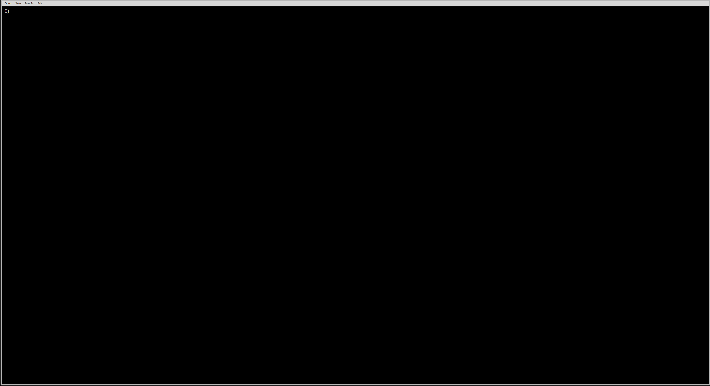

# PTextEditor
___

жесткий текст эдитор, с помощью которого писали виндофс, линух, махос.
имеет функцию, без которой этот продукт был-бы безполезен (exit)
с black theme

:octocat::octocat::octocat:

